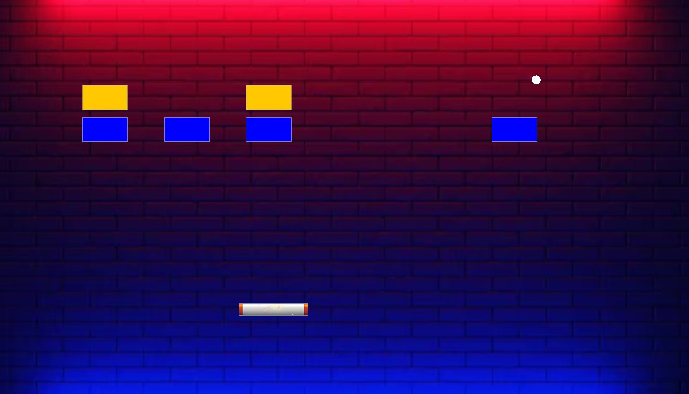

# 🧱 BreakTheBrick

**BreakTheBrick** is a classic brick-breaking desktop game built using **JavaFX** and **Swing**, designed for smooth gameplay, dynamic logic, and a visually engaging experience. Whether you're smashing blocks or dodging the ball, this game delivers fast-paced fun with a clean Java implementation.

---

## 🎮 Features

- 🕹️ **Responsive Controls** – Smooth paddle movement and ball physics
- 🎨 **JavaFX + Swing UI** – Hybrid interface for dynamic rendering
- 🧠 **Game Logic** – Collision detection, score tracking, and level progression
- 🔄 **Dynamic Updates** – Real-time brick destruction and ball rebound
- 💾 **Lightweight & Portable** – Runs on any system with Java installed

---

## 🖼️ Gameplay Preview



> *Screenshot of the main game window showing paddle, ball, and bricks in action.*

---

## 🚀 Getting Started

### Requirements
- Java 8 or higher
- JavaFX libraries (included in JDK 8 or added separately for later versions)

### Run the Game
```bash
javac BreakTheBrick.java
java BreakTheBrick
